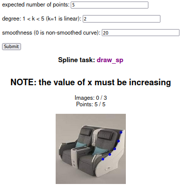
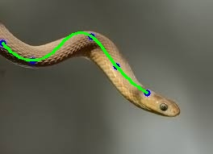

# Spline drawing tool

__Draw spline__

The tool gets a set of images, smoothness factor, degree of spline, and the expected number of points that are used for interpolation.Scipy interpolation method applied to the marked points to calculate a B-spline representation of an 1-D curve.



__Output__

After marking points on all images the results are shown as demonstration of fitted curve. Plus, the marked points are stord in "/images" as .json that can be used for annotation purposes. 

 | 

####Note: after marking the last point left click will go for the next image

## Installation

Python>=3.7

```
pip install -r requirements.txt
```

## Configuration

Edit config.py

##### INPUT_DIR


INPUT_DIR = "/home/ubuntu/draw_spline/input"

Put you images in INPUT_DIR

Edit INPUT_DIR to your abs input path 

##### IMAGE_DIR
IMAGE_DIR = "/home/ubuntu/draw_spline/images"

The directory where the results will be stored. Will be automatically created if it does not exist. Also, will be cleared after re-running.

##### SPNAME

The prefix name for the splined images

## Usage 
1. Store your images in INPUT_DIR
2. Start the spline server: `python3 start.py`
3. Enter expected number of points to be mark on the images
4. Indicate the degree of spline "k". This is value between 1 and 5 which k=1 returns a linear B-spline
5. Enter the smoothness factor "s" which s=0 results a non-smoothed curve
6. Submit
7. Open your browser at [http://localhost:5000](http://localhost:5000) and start landmarking. (Note: based on B-spline your x(-->) values must be increasing along x axis)

You can supply an alternative hostname and port to `start.py`.

## To do 

1. Add a browse for uploading images by user
2. Testing optimized curve fitting algorithms
3. Develop for y value increasing
4. Connect landmarks using cv2.line() method

